# 📱⚡ ConnectionX — Free Phone Service, Everything Upgraded


[](https://github.com/credkellar/ConnectionX/actions/workflows/ci.yml)
[](https://github.com/credkellar/ConnectionX/actions/workflows/docker-publish.yml)

> 📝 **Workflow badges updated, honestly:** the two badges above are static shields linked to the real Actions pages. The live `badge.svg` URLs for `ci.yml` and `docker-publish.yml` were checked at build time and return **404** — they light up only after the owner pastes the two workflow files into `.github/workflows/` (plural) and they run once. This README does not fake a green run.

## 📖 What is this about?

📱 ConnectionX is a **free phone service** — talk, text, and data — with **everything upgraded** to the newest way of doing it. A normal phone plan charges you every month for a plastic SIM card, old-style calls, and plain SMS texts. ConnectionX flips every one of those to the free, upgraded version:

| Part | Old way 💸 | ConnectionX way ⚡ |
|---|---|---|
| Talk | Circuit calls, low-quality sound | **Vo5G + VoWiFi**, EVS Fullband sound |
| Text | SMS only, no pictures | **RCS first** (pictures, receipts, group chat), SMS fallback |
| SIM | Plastic card, store visit, activation fee | **Free eSIM**, download and go |
| Connection | Tower only | **Wi-Fi first, tower second** |
| Number | Paid line from a carrier | **Free number** inside the service |
| Data | All paid | Wi-Fi data $0 + **1 GB essential-app data $0** on cellular |
| Bill | Monthly, always | **Core bill: $0** |

Around that core sit the seats Darion stacks on his projects: a **Gemini Argon 4 Extended Thinking** decider with a **Muse** advisor, **all 4 Google Flows** as a plan-only seat, the **sandbox-api chamber** guarding every payload, **HoneypotX** watching the doors, and **Google Cloud + Google Drive** seats that plan the hosting and file home without ever connecting live.

## 🧰 Tech Stack Badges & Full Architecture Tech Stack

### 💻 Core Programming Languages & Core Systems


- 🐍 **Python 3.12** — the whole service, standard library only, zero runtime dependencies
- 🧩 **One package, small modules** — `connectionx/` splits the service into numbers, routing, voice, messaging, eSIM, data, upgrade, council, and gates, plus the stacked seats
- 🔐 **SHA-256 everywhere it matters** — eSIM profile IDs, chamber sample fingerprints, and Drive registry hashes
- 📤 **JSON in, JSON out** — every CLI command prints one JSON report

### ⛓️ Web3 & Infrastructure

*None — honestly. ConnectionX has no blockchain, no wallet, and no token. Its infrastructure is the phone system itself:*

- 📡 **Radio path (modelled):** phone → radio waves → cell tower → carrier core → internet / other phone
- 📶 **Bearers:** VoWiFi, Vo5G, VoLTE for voice; RCS / SMS for text; Wi-Fi and 5G / LTE for data; 6G exists as a simulation profile only
- 🏢 **Carrier truth:** the towers belong to carriers — ConnectionX is the service layer on top, Wi-Fi-first, with live carrier action behind HOLD gates

### ⚙️ Platform Support & Hardware Architecture


- 🐧 **Linux** servers and desktops, 🪟 **Windows** and 🍎 **macOS** anywhere Python 3.10+ runs
- 📱 **Phone-first** — light enough to run in Termux on the owner's Android phone
- 🐳 **Docker** — the image builds from the repo `Dockerfile` and runs the self-checks at build time
- 📲 **eSIM-capable phones** are the target handset: no plastic SIM, no special hardware

### ⚡ Low-Level Infrastructure & Performance


- 🎙️ **Codec ladder:** AMR-NB → AMR-WB (HD Voice) → EVS Fullband, picked per bearer
- 📶 **Wi-Fi offload engine:** every action is priced on Wi-Fi first; the ledger reports the offload percentage and the modelled savings
- 🧪 **Static chamber budgets:** 100,000-step and 5-second budgets per sample, FS-diff telemetry, network attempts hard-zero by design (the chamber imports no socket machinery)
- 🕐 **Deterministic core:** number allocation, call logs, and trap-log scoring are reproducible run to run

### 🛠️ DevOps & Build Tools

[](https://github.com/credkellar/ConnectionX/actions/workflows/ci.yml)
[](https://github.com/credkellar/ConnectionX/actions/workflows/docker-publish.yml)


- ✅ **CI** (`ci.yml`) — Python 3.12 → install pytest → `pytest -q` → `python checks.py` → demo smoke test
- 🐳 **Docker Publish** (`docker-publish.yml`) — login with this repo's own `DOCKERHUB_USERNAME` + `DOCKERHUB_TOKEN` secrets → build & push `credkellar/connectionx:latest`
- 🔑 **Secrets are per-repo:** a secret set in another repo does not carry over; the two secrets above are the owner's paste step in this repo's Settings

### ☁️ Cloud Providers


- ☁️ **Google Cloud (plan only):** Cloud Run hosts the API, Firestore holds modelled subscriber records, Cloud Storage holds exports and backups, Pub/Sub carries events, Cloud Logging holds traces — 0 live connections, nothing deployed
- 📁 **Google Drive (registry only):** 10 named folders and a one-name-one-hash local registry; nothing uploaded, real Drive access is a HOLD gate
- 🧠 **AI seats (names only):** `GEMINI_API_KEY` for the Argon 4 decider seat and `MODEL_API_KEY` for the Muse advisor seat — presence only, no live calls

## 🔧 What this does? Step-by-step

1. 🆓 **Activate** — `activate` hands a subscriber a free synthetic number (555-01XX range) and a free eSIM profile, and enables it. Cost: $0.
2. 🛣️ **Route** — every call, text, and data request passes the routing engine, which picks the cheapest working transport: Wi-Fi first, cellular second.
3. 📞 **Call** — voice picks its bearer (VoWiFi / Vo5G / VoLTE) and its upgraded codec (EVS Fullband / AMR-WB), and writes the call to the log at $0.
4. 💬 **Text** — messaging sends RCS with media, receipts, and group features, or falls back to SMS with honest segment counting.
5. 🌐 **Use data** — the ledger records each use: `free-wifi`, `free-essential` (essential apps up to 1,024 MB on cellular), or `needs-data-pass` — never a fake "free".
6. 🧪 **Screen payloads** — any payload entering the service passes the sandbox-api chamber first: static marker scan, 4 clean service payloads allowed for study, 3 dangerous ones held, nothing executed, network attempts 0.
7. 🍯 **Watch the doors** — HoneypotX classifies the synthetic trap log (12 attempts, top threat 100) with no listener opened and no access granted.
8. 🎬 **Plan media** — all 4 Google Flows produce the video / doc plan for both brains; nothing is rendered and no live call is made.
9. 🧠 **Decide** — the council reviews big questions: Argon 4 runs MAP → MODEL → STRESS → DECIDE; Muse advises, tighten-only.
10. 🛑 **Gate** — 18 HOLD gates stop anything live or dangerous: carrier activation, spectrum transmission, emergency routing, detonation, listeners, rendering, cloud sync, Drive access, and more.
11. ☁️ **Plan the cloud** — the Google Cloud seat prints the deployment plan and the Drive seat registers files locally with SHA-256 fingerprints; conflicts are HELD, never overwritten.
12. 🧾 **Bill** — the report adds it all up: talk $0, text $0, eSIM $0, essential data $0. **Total: $0.**

## ⚙️ How this works — master flowchart

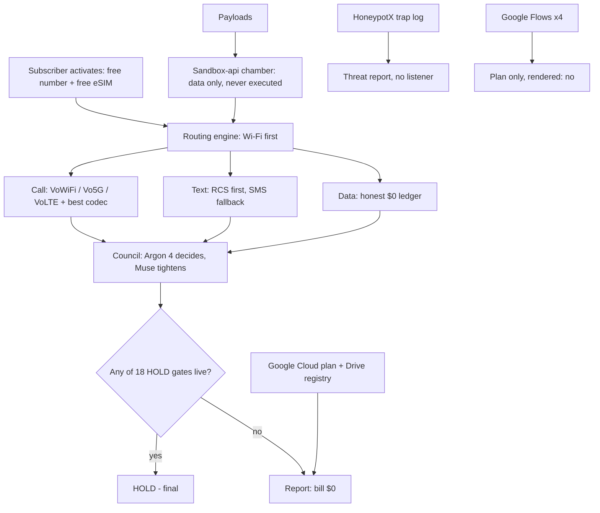
```mermaid
flowchart TD
    A[Subscriber activates: free number + free eSIM] --> B[Routing engine: Wi-Fi first]
    B --> C[Call: VoWiFi / Vo5G / VoLTE + best codec]
    B --> D[Text: RCS first, SMS fallback]
    B --> E[Data: honest $0 ledger]
    F[Payloads] --> G[Sandbox-api chamber: data only, never executed]
    G --> B
    H[HoneypotX trap log] --> I[Threat report, no listener]
    J[Google Flows x4] --> K[Plan only, rendered: no]
    C --> L[Council: Argon 4 decides, Muse tightens]
    D --> L
    E --> L
    L --> M{Any of 18 HOLD gates live?}
    M -->|yes| N[HOLD - final]
    M -->|no| O[Report: bill $0]
    P[Google Cloud plan + Drive registry] --> O
```

## 🗺️ Mermaid flowchart diagram per script

### ▶️ `main.py` — the door

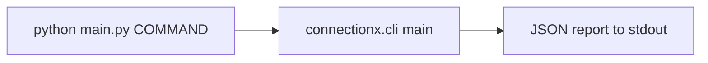
```mermaid
flowchart LR
    A[python main.py COMMAND] --> B[connectionx.cli main]
    B --> C[JSON report to stdout]
```

### ✅ `checks.py` — the self-test

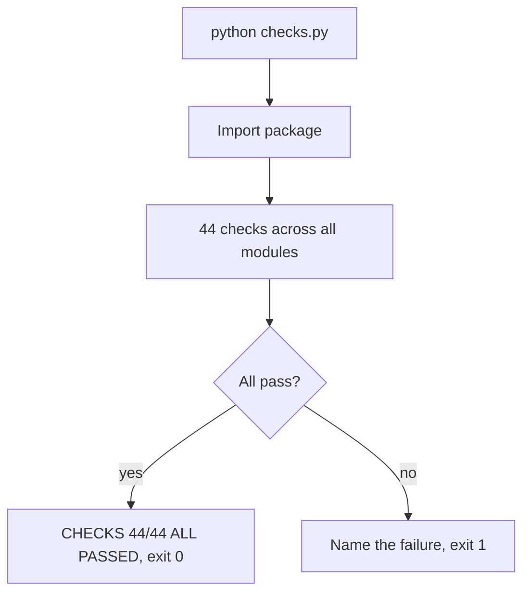
```mermaid
flowchart TD
    A[python checks.py] --> B[Import package]
    B --> C[44 checks across all modules]
    C --> D{All pass?}
    D -->|yes| E[CHECKS 44/44 ALL PASSED, exit 0]
    D -->|no| F[Name the failure, exit 1]
```

### 📦 `connectionx/__init__.py` — the crate label

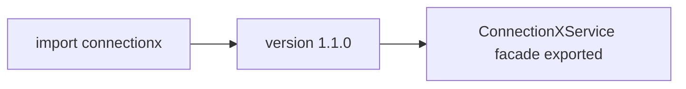
```mermaid
flowchart LR
    A[import connectionx] --> B[version 1.1.0]
    B --> C[ConnectionXService facade exported]
```

### 🔢 `connectionx/numbers.py` — free numbers

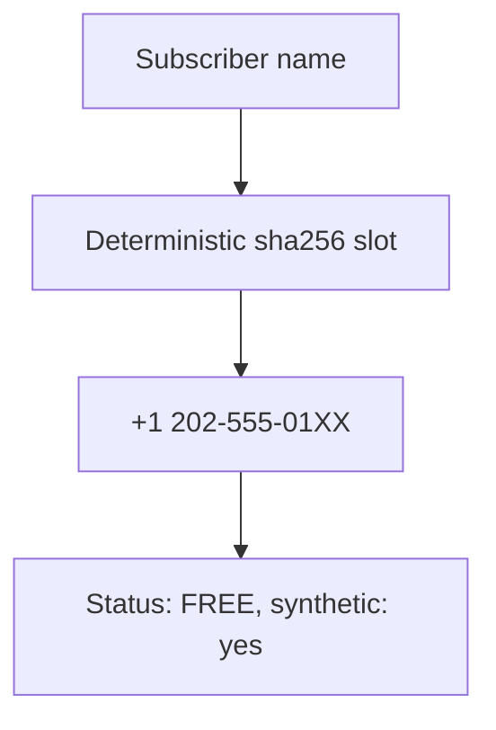
```mermaid
flowchart TD
    A[Subscriber name] --> B[Deterministic sha256 slot]
    B --> C[+1 202-555-01XX]
    C --> D[Status: FREE, synthetic: yes]
```

### 🛣️ `connectionx/routing.py` — Wi-Fi first

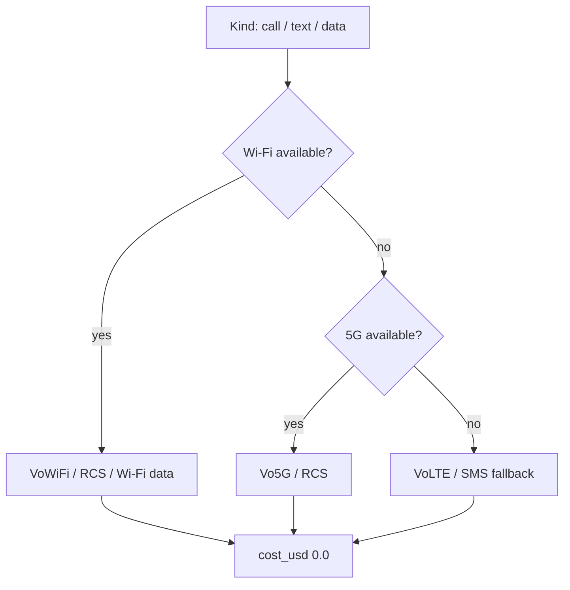
```mermaid
flowchart TD
    A[Kind: call / text / data] --> B{Wi-Fi available?}
    B -->|yes| C[VoWiFi / RCS / Wi-Fi data]
    B -->|no| D{5G available?}
    D -->|yes| E[Vo5G / RCS]
    D -->|no| F[VoLTE / SMS fallback]
    C --> G[cost_usd 0.0]
    E --> G
    F --> G
```

### 📞 `connectionx/voice.py` — upgraded calls

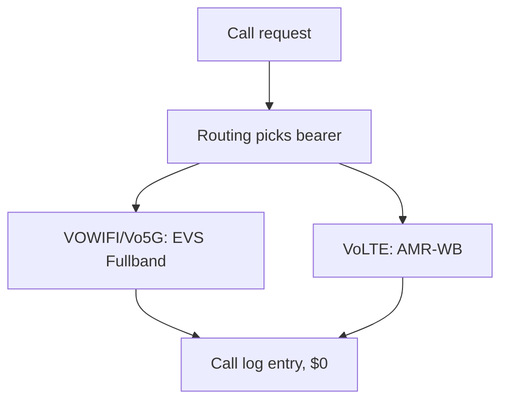
```mermaid
flowchart TD
    A[Call request] --> B[Routing picks bearer]
    B --> C[VOWIFI/Vo5G: EVS Fullband]
    B --> D[VoLTE: AMR-WB]
    C --> E[Call log entry, $0]
    D --> E
```

### 💬 `connectionx/messaging.py` — RCS first

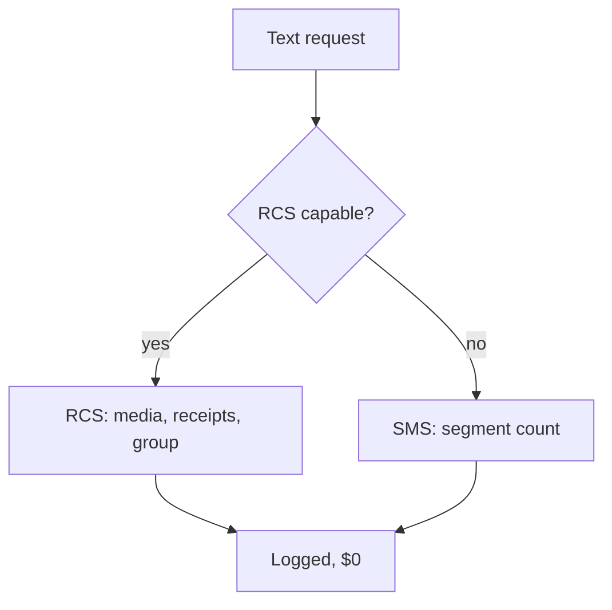
```mermaid
flowchart TD
    A[Text request] --> B{RCS capable?}
    B -->|yes| C[RCS: media, receipts, group]
    B -->|no| D[SMS: segment count]
    C --> E[Logged, $0]
    D --> E
```

### 📲 `connectionx/esim.py` — free eSIM

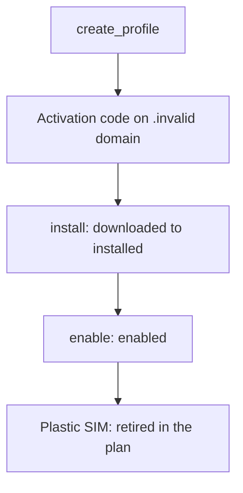
```mermaid
flowchart TD
    A[create_profile] --> B[Activation code on .invalid domain]
    B --> C[install: downloaded to installed]
    C --> D[enable: enabled]
    D --> E[Plastic SIM: retired in the plan]
```

### 🌐 `connectionx/data.py` — the honest $0 ledger

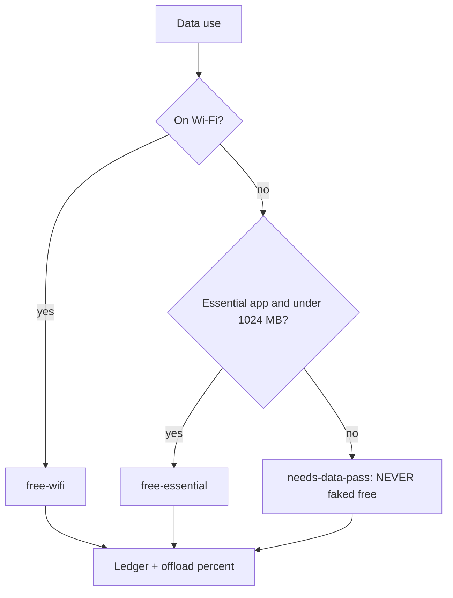
```mermaid
flowchart TD
    A[Data use] --> B{On Wi-Fi?}
    B -->|yes| C[free-wifi]
    B -->|no| D{Essential app and under 1024 MB?}
    D -->|yes| E[free-essential]
    D -->|no| F[needs-data-pass: NEVER faked free]
    C --> G[Ledger + offload percent]
    E --> G
    F --> G
```

### ⬆️ `connectionx/upgrade.py` — the upgrade board

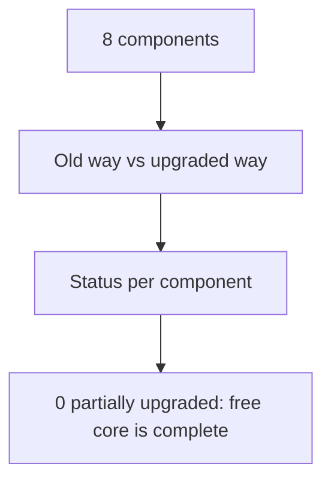
```mermaid
flowchart TD
    A[8 components] --> B[Old way vs upgraded way]
    B --> C[Status per component]
    C --> D[0 partially upgraded: free core is complete]
```

### 🧠 `connectionx/council.py` — two brains

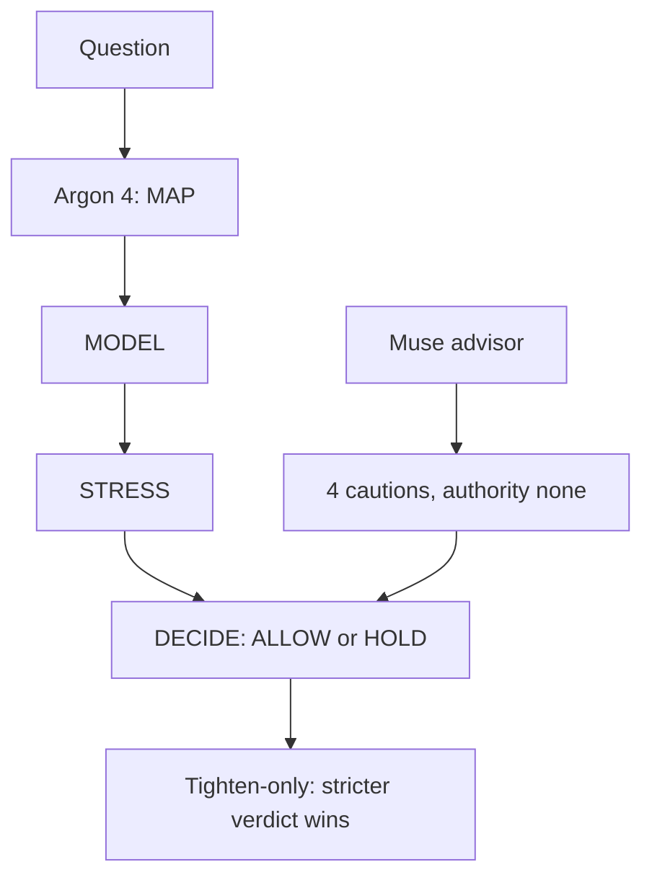
```mermaid
flowchart TD
    A[Question] --> B[Argon 4: MAP]
    B --> C[MODEL]
    C --> D[STRESS]
    D --> E[DECIDE: ALLOW or HOLD]
    F[Muse advisor] --> G[4 cautions, authority none]
    G --> E
    E --> H[Tighten-only: stricter verdict wins]
```

### 🛑 `connectionx/gates.py` — 18 HOLD gates

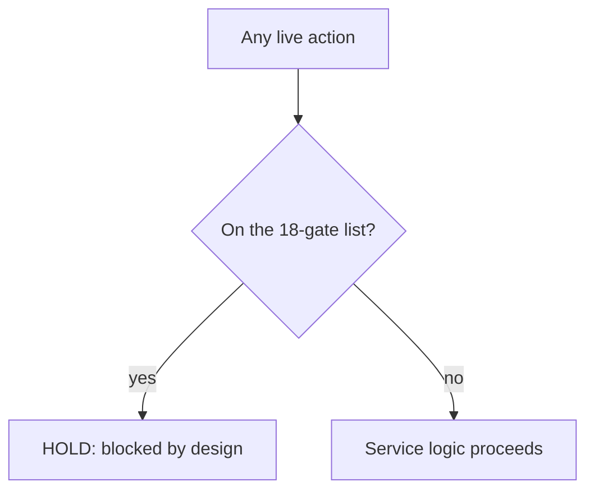
```mermaid
flowchart TD
    A[Any live action] --> B{On the 18-gate list?}
    B -->|yes| C[HOLD: blocked by design]
    B -->|no| D[Service logic proceeds]
```

### 🎬 `connectionx/google_flow.py` — all 4 Google Flows

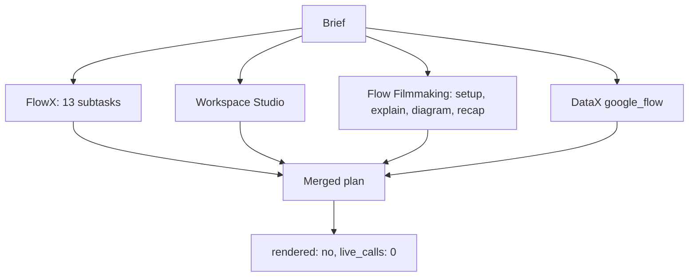
```mermaid
flowchart TD
    A[Brief] --> B[FlowX: 13 subtasks]
    A --> C[Workspace Studio]
    A --> D[Flow Filmmaking: setup, explain, diagram, recap]
    A --> E[DataX google_flow]
    B --> F[Merged plan]
    C --> F
    D --> F
    E --> F
    F --> G[rendered: no, live_calls: 0]
```

### 🧪 `connectionx/sandbox_api.py` — the chamber (verbatim seat)

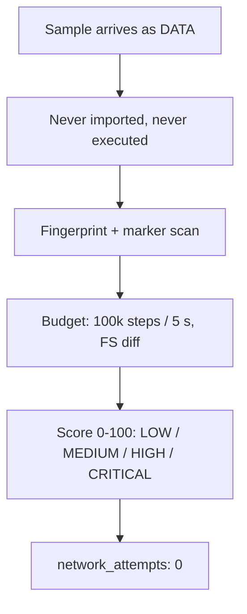
```mermaid
flowchart TD
    A[Sample arrives as DATA] --> B[Never imported, never executed]
    B --> C[Fingerprint + marker scan]
    C --> D[Budget: 100k steps / 5 s, FS diff]
    D --> E[Score 0-100: LOW / MEDIUM / HIGH / CRITICAL]
    E --> F[network_attempts: 0]
```

### 📦 `connectionx/payloads.py` — phone payload triage

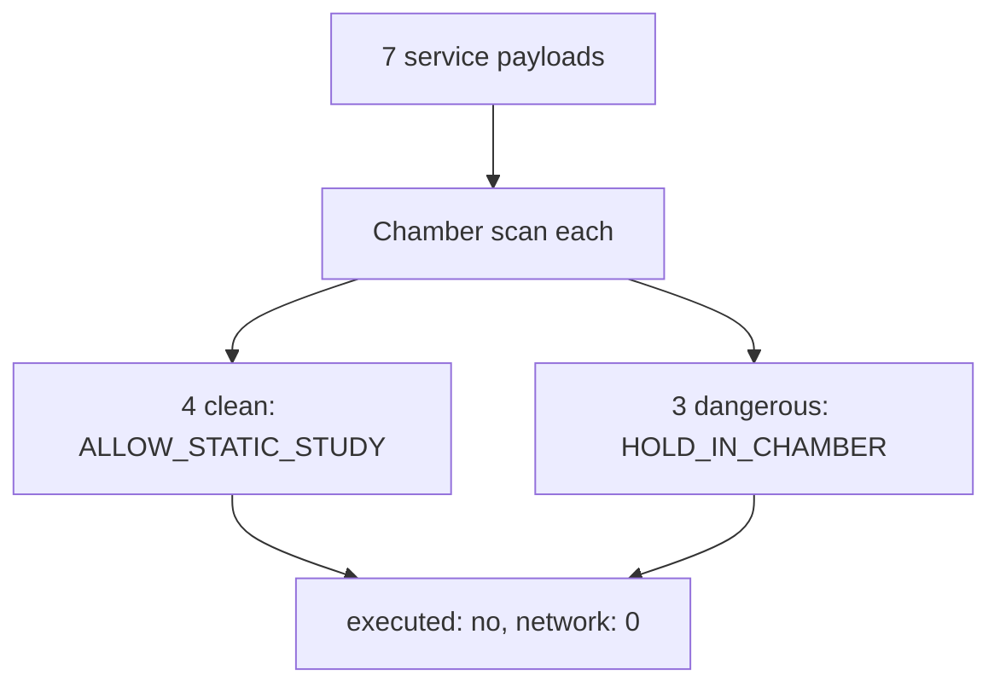
```mermaid
flowchart TD
    A[7 service payloads] --> B[Chamber scan each]
    B --> C[4 clean: ALLOW_STATIC_STUDY]
    B --> D[3 dangerous: HOLD_IN_CHAMBER]
    C --> E[executed: no, network: 0]
    D --> E
```

### 🍯 `connectionx/honeypotx.py` — the trap log

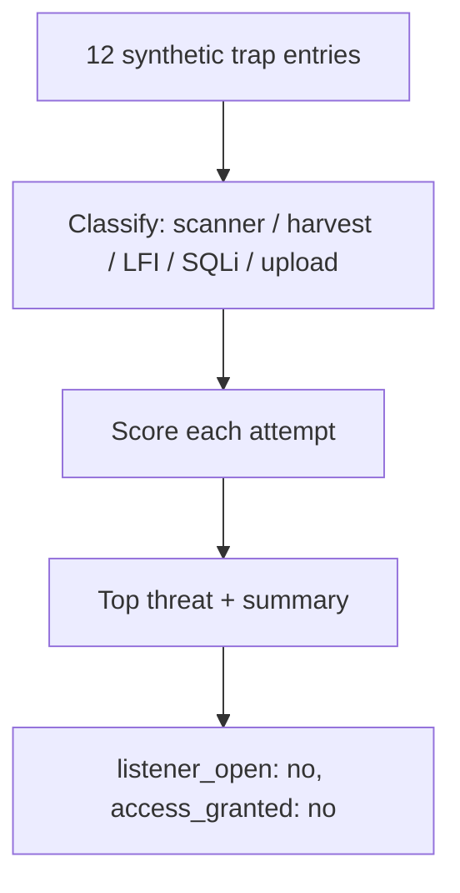
```mermaid
flowchart TD
    A[12 synthetic trap entries] --> B[Classify: scanner / harvest / LFI / SQLi / upload]
    B --> C[Score each attempt]
    C --> D[Top threat + summary]
    D --> E[listener_open: no, access_granted: no]
```

### ☁️ `connectionx/google_cloud.py` — Google Cloud seat

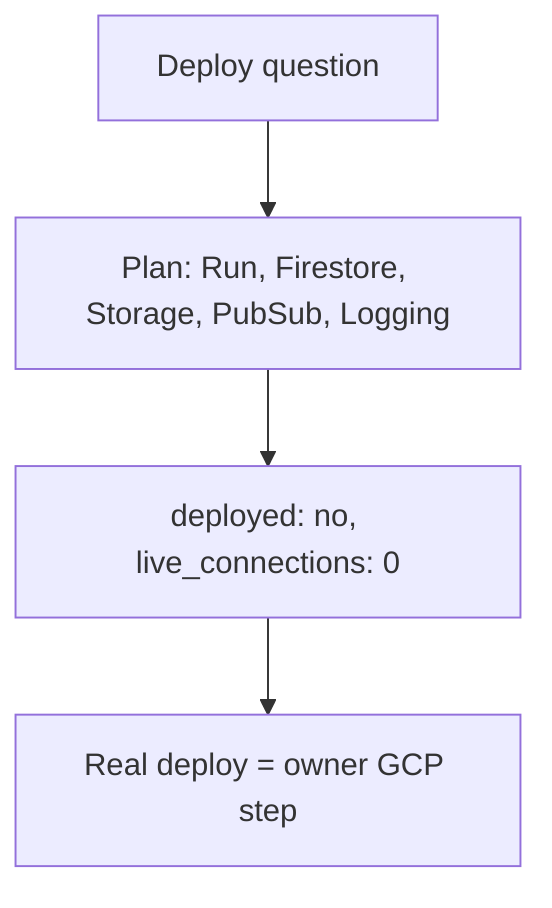
```mermaid
flowchart TD
    A[Deploy question] --> B[Plan: Run, Firestore, Storage, PubSub, Logging]
    B --> C[deployed: no, live_connections: 0]
    C --> D[Real deploy = owner GCP step]
```

### 📁 `connectionx/google_drive.py` — Google Drive seat

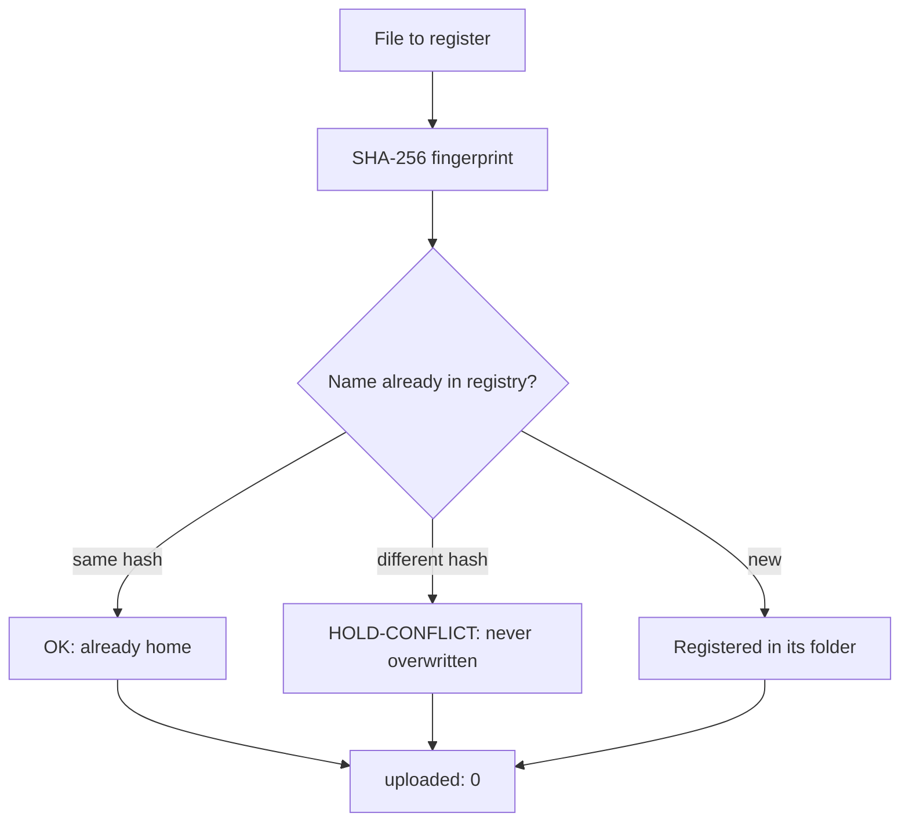
```mermaid
flowchart TD
    A[File to register] --> B[SHA-256 fingerprint]
    B --> C{Name already in registry?}
    C -->|same hash| D[OK: already home]
    C -->|different hash| E[HOLD-CONFLICT: never overwritten]
    C -->|new| F[Registered in its folder]
    D --> G[uploaded: 0]
    E --> G
    F --> G
```

### 🏛️ `connectionx/service.py` — the one facade

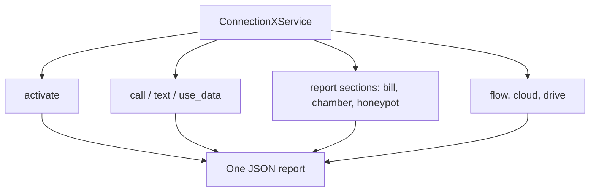
```mermaid
flowchart TD
    A[ConnectionXService] --> B[activate]
    A --> C[call / text / use_data]
    A --> D[report sections: bill, chamber, honeypot]
    A --> E[flow, cloud, drive]
    B --> F[One JSON report]
    C --> F
    D --> F
    E --> F
```

### 💻 `connectionx/cli.py` — the commands

```mermaid
flowchart LR
    A[demo / upgrade / gates / council] --> Z[JSON out]
    B[flow / chamber / honeypot] --> Z
    C[cloud / drive] --> Z
```

### 🧪 `tests/test_connectionx.py` — the proof

```mermaid
flowchart TD
    A[pytest -q] --> B[25 tests]
    B --> C[Core service + all seats]
    C --> D[25 passed]
```

## 😎 Why is this cool? 10 reasons this is cool

1. 🆓 **The bill is $0** — talk, text, eSIM, and essential data, priced at zero by design.
2. ⚡ **Every part is upgraded** — Vo5G, VoWiFi, EVS sound, RCS, eSIM: the newest version of each piece.
3. 📶 **Wi-Fi first** — the smartest free trick in phones: use the free road before the paid one.
4. 📲 **No plastic** — the SIM is software now; activation is a download, not a store visit.
5. 🧠 **Two brains, one rule** — Argon 4 decides, Muse can only make it stricter, never looser.
6. 🎬 **All 4 Google Flows** — FlowX, Workspace Studio, Flow Filmmaking, and DataX in one plan seat.
7. 🧪 **Safety you can audit** — every payload passes a chamber that can never run it.
8. 🍯 **It watches back** — HoneypotX logs who pokes at the service, with no door actually open.
9. ☁️ **Cloud without the keys** — Google Cloud and Drive seats are fully planned, zero live connections.
10. ✅ **Proven, not promised** — 25 pytest tests and 44 self-checks pass in a clean copy before anything ships.

## 🧩 What problems this solves? 10 solutions

1. **Problem:** Phone bills charge for talk and text that ride free on Wi-Fi → **Solution:** Wi-Fi-first routing prices Wi-Fi actions at $0.
2. **Problem:** SMS is stuck in 1992 — no pictures, no receipts → **Solution:** RCS first with media, receipts, and group chat; SMS only as fallback.
3. **Problem:** Plastic SIMs mean stores, fees, and waiting → **Solution:** free eSIM profiles with a clear state machine.
4. **Problem:** "Free data" claims hide the fine print → **Solution:** the ledger says exactly which data is free, and marks the rest `needs-data-pass` instead of faking it.
5. **Problem:** Old calls sound bad → **Solution:** a codec ladder that picks EVS Fullband on 5G and Wi-Fi bearers.
6. **Problem:** Malicious payloads slip into phone services → **Solution:** a static-only chamber screens everything; dangerous samples are HELD, never executed.
7. **Problem:** Attackers probe services unseen → **Solution:** HoneypotX classifies trap-log attempts and scores the threat.
8. **Problem:** AI features quietly make live calls and spend money → **Solution:** both brain seats run names-only and plan-only until the owner plugs keys; live calls are a HOLD gate.
9. **Problem:** Cloud files get overwritten by sync conflicts → **Solution:** the Drive registry's one-name-one-hash rule HOLDS conflicts instead of overwriting.
10. **Problem:** Big phone features get promised but never verified → **Solution:** 44 self-checks + 25 tests + a Docker build that runs the checks before the image ships.

## 💻 How to install this? Step by step

1. 📥 **Get the code** — clone this repo, or pull the image in step 5.
2. 🐍 **Install Python 3.10 or newer** — that is the only runtime requirement.
3. ▶️ **Run the demo** — from the repo folder:

```bash
python main.py demo
```

4. ✅ **Verify it** — run the full proof:

```bash
python -m pytest -q
python checks.py
```

5. 🐳 **Or run it in Docker:**

```bash
docker build -t credkellar/connectionx .
docker run --rm credkellar/connectionx
```

6. 🔍 **Explore the seats** — try `python main.py chamber`, `python main.py honeypot`, `python main.py flow`, `python main.py cloud`, and `python main.py drive`.
7. 🔑 **(Optional, owner only)** — plug the seat keys by name only: `GEMINI_API_KEY`, `MODEL_API_KEY`. Nothing calls out live either way; live use stays behind HOLD gates.
8. 🚀 **(Publishing, owner only)** — paste `ci.yml` and `docker-publish.yml` into `.github/workflows/` (plural), set this repo's `DOCKERHUB_USERNAME` + `DOCKERHUB_TOKEN` secrets, and push to publish `credkellar/connectionx:latest`.

## 📋 Requirements

- 🐍 Python 3.10+ (developed and verified on 3.12)
- 📦 Zero third-party runtime dependencies — standard library only
- 🧪 pytest, only if you want to run the test suite
- 🐳 Docker, only if you want the container route
- 📶 A phone network is **not** required to run or study the service — and live carrier use stays gated

## 🧒 Explain in 5th grade English

📱 Your phone talks by sending invisible waves to a tower, like shouting to a friend on a hill who shouts it onward. ConnectionX is a phone service that always tries the **free** way first: if your house Wi-Fi can carry your call or text, it rides free. Your phone card is not plastic anymore — it is a tiny file your phone downloads for free. Texts got upgraded too: pictures and little "I saw it" checkmarks, not just plain words. And there is a super careful robot guard: anything strange has to sit in a glass box and get looked at, but it is **never** allowed to run. At the end, the bill says the best number of all: **$0**.

## 🌳 FULL project structure tree

```text
connectionx/
├── .github/
│   └── workflows/
│       ├── ci.yml
│       └── docker-publish.yml
├── connectionx/
│   ├── __init__.py
│   ├── cli.py
│   ├── council.py
│   ├── data.py
│   ├── esim.py
│   ├── gates.py
│   ├── google_cloud.py
│   ├── google_drive.py
│   ├── google_flow.py
│   ├── honeypotx.py
│   ├── messaging.py
│   ├── numbers.py
│   ├── payloads.py
│   ├── routing.py
│   ├── sandbox_api.py
│   ├── service.py
│   ├── upgrade.py
│   └── voice.py
├── tests/
│   └── test_connectionx.py
├── .gitignore
├── Dockerfile
├── LICENSE
├── README.md
├── checks.py
├── main.py
└── requirements.txt
```

## ⚠️ Honest scope

ConnectionX is a **real service layer**, verified end to end — and it is honest about what a service layer is. The code really routes, prices, logs, screens, and reports; every number it prints is computed. What it does **not** do: own towers, transmit on licensed spectrum, activate on a real carrier, route emergency calls, or port real numbers. Radio speeds are **modelled, not measured**. The free core works the way free phone services really work — Wi-Fi-first plus a defined essential-apps allowance — and anything beyond that is labelled a data pass, never faked free. The 18 HOLD gates are the fence, and they stay down until the owner, with a carrier and the law on his side, says otherwise.

## 📄 License

MIT — see `LICENSE`.
